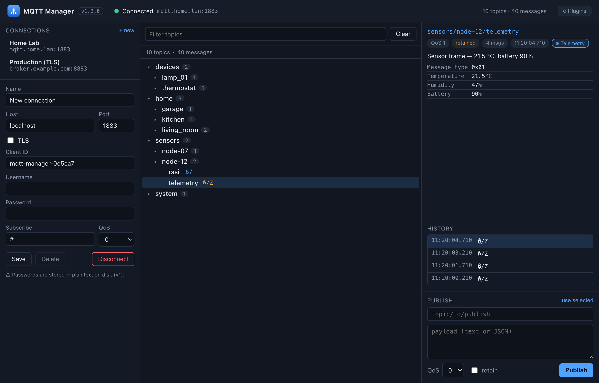

# MQTT Manager

A desktop MQTT client — a live topic tree, per-topic value inspection with history,
publishing, and saved broker connections. Built with [Wails](https://wails.io) (Go backend +
Svelte/TypeScript frontend).



> Showing a raw binary payload decoded into fields by a custom plugin. Demo data — not real brokers.

## Features (v1)

- **Connections** — save multiple broker profiles (host/port, TLS, auth, client ID, default
  subscription). Stored at `<user-config-dir>/mqtt-manager/profiles.json`.
- **TLS** — connect over `ssl://` with an optional CA certificate and an insecure-skip-verify
  toggle.
- **Live topic tree** — auto-builds a hierarchical tree from incoming messages, with a filter
  box, value previews, message counts, and update flashes.
- **Topic detail** — latest payload (JSON pretty-printed when applicable), metadata
  (QoS / retained / timestamp / count), and a recent value history.
- **Publish** — send messages with topic, payload, QoS, and retain flag.
- **Decoder plugins** — custom JavaScript decoders that turn project-specific binary/encoded
  payloads into a readable field view in the detail panel. See [Plugins](#plugins).

Incoming messages are throttled on the Go side (batched every 100 ms) so a busy broker can't
flood the UI.

## Plugins

A plugin is a small JavaScript module that decodes matching MQTT payloads for display. When a
selected topic matches an enabled plugin, the detail panel renders the plugin's structured
output (with a toggle back to the raw view).

Plugins are managed from the **Plugins** button in the header, and stored as plain `.js`
files in `<user-config-dir>/mqtt-manager/plugins/` (an `index.json` tracks name/enabled/order).
Drop a `.js` file into that folder and it appears in the manager (disabled by default), so
plugins are shareable by copying a file. The manager also has **import** (pick a `.js` file to
add as a new plugin) and **export** (write the selected plugin's `.js` anywhere) for sharing
without touching the config folder.

### Authoring

A plugin file is plain JavaScript: declare any helpers first, then a single trailing
`export default`. No other `import`/`export` is supported (the body is evaluated with
`new Function`, and `export default` is rewritten to `return`).

```js
export default {
  name: "My decoder",
  topic: "my/topic/+",            // MQTT-style filter (+ and # wildcards)
  // Optional predicate — return false to let another plugin handle the message.
  match(ctx) { return ctx.bytes.length > 2; },
  decode(ctx) {
    // ctx = { topic, bytes: Uint8Array, hex: string, text: string, ts: number|null }
    return {
      summary: "one-line headline",                 // optional
      fields: [{ label: "rssi", value: -73, hint: "dBm" }], // label/value table
      json: { any: "object" },                       // optional pretty-printed JSON block
      text: "raw block",                             // optional monospace block
      // html: "<div>…</div>",                       // optional escape hatch (see below)
      // error: "..."                                // optional; shows an error banner
    };
  },
};
```

`decode()` must return a plain (JSON-serialisable) object. Plugins run in a Web Worker off the
UI thread; a plugin that throws shows an error banner, and one that hangs is watchdog-terminated
and disabled for the session.

#### Custom rendering (`html`)

For anything the structured `fields`/`json`/`text` can't express, return an **`html`** string —
it's rendered verbatim in the right panel and takes precedence over the structured fields, so the
plugin fully owns its presentation (custom layout, colours, gauges, multi-column, etc.):

```js
decode(ctx) {
  return {
    html: `<div style="display:grid;grid-template-columns:auto 1fr;gap:4px 12px">
      <b>node</b><span>${ctx.bytes[0]}</span>
      <b>state</b><span style="color:var(--ok)">online</span>
    </div>`,
  };
}
```

Use the app's CSS variables to match the theme: `--accent`, `--text`, `--text-dim`, `--border`,
`--ok`, `--warn`, `--err`, `--bg-inset`, `--bg-hover`, `--mono`. The markup is author-trusted
(same trust model as the decoder JS itself); `<script>` does not execute.

### Subtree plugins (group / gateway cards)

Set `scope: "subtree"` to render a card for a *branch* topic — one that groups others and
carries no message of its own (e.g. a gateway ID). Instead of one payload, `decode(ctx)`
receives a snapshot of every descendant topic's latest value, so the card is stable regardless
of the order messages arrived in:

```js
export default {
  name: "Gateway overview",
  scope: "subtree",
  topic: "gg/gw/+",               // matches the gateway (branch) topic
  decode(ctx) {
    // ctx.topic, ctx.keys(), and per relative-path accessors:
    //   ctx.get(rel) text · ctx.num(rel) number · ctx.json(rel) parsed JSON
    //   ctx.bytes(rel) Uint8Array · ctx.ts(rel) last-update millis
    return {
      summary: `Gateway ${ctx.topic.split("/").pop()}`,
      fields: [
        { label: "battery", value: ctx.num("status/battery"), hint: "V" },
        { label: "rssi",    value: ctx.num("status/rssi"),    hint: "dBm" },
      ],
    };
  },
};
```

Subtree plugins are tagged `subtree` in the manager and return the same `{summary, fields}`
card shape as normal plugins (or their own `html`). Since a plugin file has a single `scope`, a
gateway card is a *companion* to a per-message decoder, not part of it.

A worked example combining both — a subtree plugin that renders its own themed HTML — is in
[`examples/plugins/solar-site.js`](examples/plugins/solar-site.js). Copy it into the plugins
folder (or use the manager's **Import**) and adapt the topic / child paths to your tree.

## Architecture

```
main.go / app.go              Wails bootstrap + JS-bound methods
internal/mqtt/                paho 3.1.1 client wrapper + message batcher (Connector interface)
internal/profiles/            connection-profile storage + TLS config builder
internal/plugins/             decoder-plugin file storage (source served to the frontend)
frontend/src/                 Svelte UI (ConnectionPanel, TopicTree, TopicDetail, PublishPanel)
frontend/src/lib/plugins.ts   plugin runtime + decoderWorker.ts (sandboxed decode worker)
```

The MQTT layer sits behind a `Connector` interface so an MQTT 5 (autopaho) backend can be
added later without touching the app layer.

## Development

Requires Go, Node, and the Wails CLI
(`go install github.com/wailsapp/wails/v2/cmd/wails@latest`).

```sh
make dev       # hot-reload dev mode
make build     # production .app bundle in build/bin (version injected from git)
make help      # list all targets
```

The version is derived from `git describe` and injected via `-ldflags` into
`main.version`, then shown in the app header.

## Releasing

Releases are driven by `scripts/release.sh` via the Makefile. Each release bumps
the [semantic version](https://semver.org), generates a `CHANGELOG.md` section
from the commits since the last tag, syncs `wails.json`, commits, and creates an
annotated git tag.

```sh
make changelog          # preview unreleased changes since the last tag
make release-patch      # x.y.Z
make release-minor      # x.Y.0
make release-major      # X.0.0
make release V=1.2.3    # explicit version

git push && git push --tags   # publish the release
```

`make dist` produces a universal (Apple Silicon + Intel) `.app` zipped for
sharing. Builds are **not** Apple-notarized, so on first launch macOS shows a
Gatekeeper prompt — open it via right-click → **Open**, or run
`xattr -dr com.apple.quarantine mqtt-manager.app`.

## Verifying

Point a profile at a broker (e.g. a local `eclipse-mosquitto` container or
`test.mosquitto.org:1883`), connect, subscribe to `#`, and publish a message — it should
appear in the tree and detail panel.

## Notes / roadmap

- v1 stores passwords in plaintext on disk — OS keychain storage is planned.
- Roadmap: MQTT 5, numeric charts/sparklines, retained-message deletion, WebSocket transport,
  message search/export.

## License

[MIT](LICENSE) © 2026 Einar Helseth
